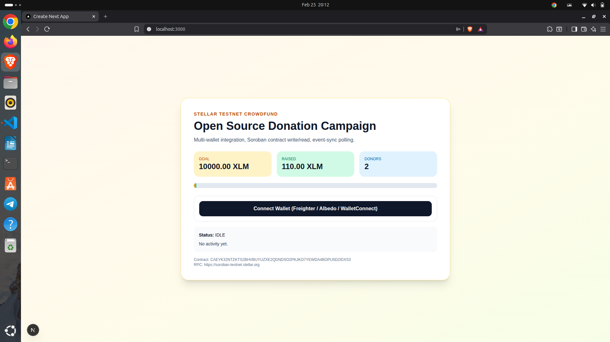
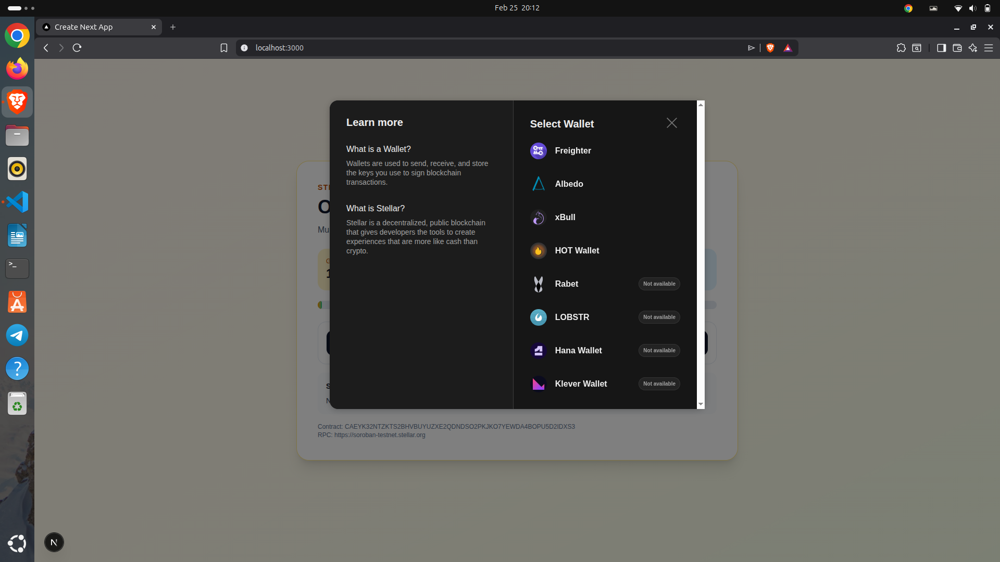
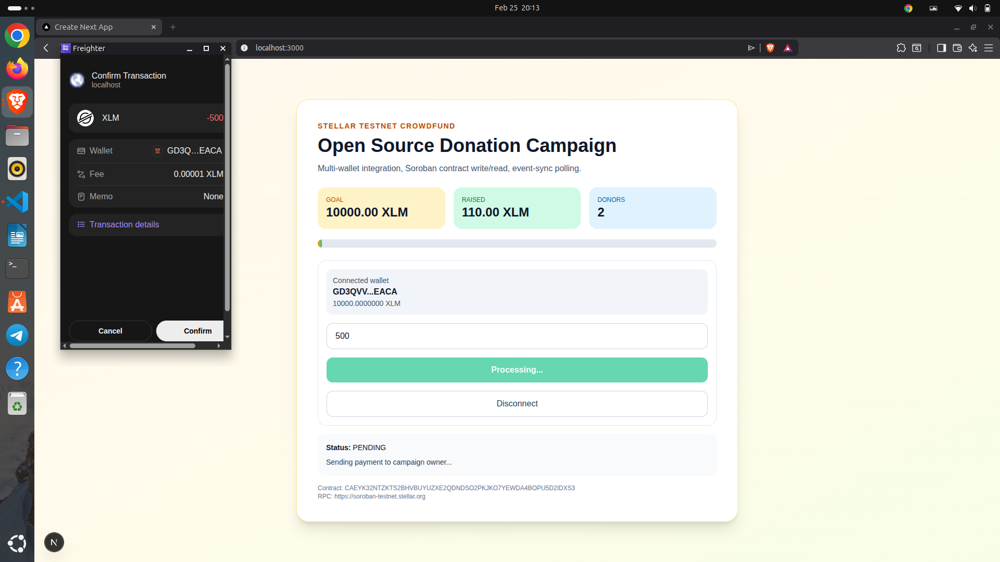
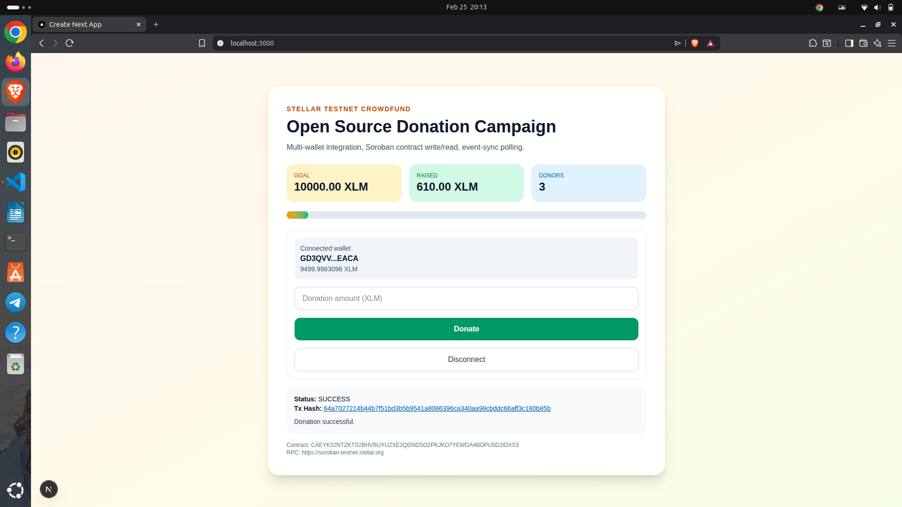

# Stellar Crowdfund dApp

Crowdfunding dApp on Stellar testnet with multi-wallet connect, Soroban contract integration, real-time updates, and transaction status tracking.

## Features

- Multi-wallet connect via StellarWalletsKit (Freighter/Albedo/WalletConnect)
- Real XLM payment to owner on donate
- Soroban contract records totals and donors
- Real-time sync (event polling + periodic reads)
- Transaction status: `pending` / `success` / `failed`

## Setup

1. Clone repo
```bash
git clone https://github.com/Abhishek-singh88/stellar-crowdfund-dapp.git
```

2. Install dependencies:
```bash
npm install
```

3. Configure env:
```bash
cp .env.example .env.local
```

4. Update `.env`:
```env
NEXT_PUBLIC_CONTRACT_ID=CAEYK32NTZKTS2BHVBUYUZXE2QDNDSO2PKJKO7YEWDA4BOPU5D2IDXS3
NEXT_PUBLIC_CAMPAIGN_GOAL_XLM=10000
NEXT_PUBLIC_STELLAR_RPC_URL=https://soroban-testnet.stellar.org
NEXT_PUBLIC_HORIZON_URL=https://horizon-testnet.stellar.org
NEXT_PUBLIC_STELLAR_NETWORK_PASSPHRASE=Test SDF Network ; September 2015
NEXT_PUBLIC_OWNER_ADDRESS=GCPWUPRZEIFCMHN4RO7CXFEFZ6RFN7P4PBVBVDUEOTIPDFBOUWGDCEZE
NEXT_PUBLIC_READONLY_ACCOUNT=GCPWUPRZEIFCMHN4RO7CXFEFZ6RFN7P4PBVBVDUEOTIPDFBOUWGDCEZE
```

5. Run locally:
```bash
npm run dev
```

## Contract Deploy (Testnet)

1. Build:
```bash
cd contracts/counter
stellar contract build
```

2. Deploy:
```bash
stellar contract deploy \
  --wasm target/wasm32v1-none/release/crowdfund_counter.wasm \
  --source my-testnet \
  --network testnet
```

3. Initialize (goal in stroops):
```bash
stellar contract invoke \
  --id YOUR_CONTRACT_ID \
  --source my-testnet-2 \
  --network testnet \
  -- initialize \
  --admin YOUR_PUBLIC_KEY \
  --goal 100000000000
```

## Contract Address
```bash
CAEYK32NTZKTS2BHVBUYUZXE2QDNDSO2PKJKO7YEWDA4BOPU5D2IDXS3
```

Explorer: [https://stellar.expert/explorer/testnet/contract/CAEYK32NTZKTS2BHVBUYUZXE2QDNDSO2PKJKO7YEWDA4BOPU5D2IDXS3](https://stellar.expert/explorer/testnet/contract/CAEYK32NTZKTS2BHVBUYUZXE2QDNDSO2PKJKO7YEWDA4BOPU5D2IDXS3)

### Main page Screenshot


### Wallet options Screenshot


### Donate Screenshot


### Success Screenshot



## Notes

- Donations send real XLM to `NEXT_PUBLIC_OWNER_ADDRESS`.
- Contract records `donate` totals for visibility and tracking.
